<h2>Quiz Site</h2>

<h4>
  Asimple Website Teacher Can publish Quizes for student 
  Students Can Solve this Quizes and see results
</h4>

<h2>Demo </h2>
<a href="https://quiz-f25d7.web.app/">Quiz Site</a>

<h2>Key features:</h2>
• <strong>teacher can create new Quiz</strong> 
• <strong>teacher can update Quiz</strong> 
• <strong>teacher can save Quiz and published it when ready</strong> 
• <strong>student can see all Quizes</strong> 
• <strong>teacher have profile </strong> 
• <strong>student can solve || test any Quiz</strong>  
• <strong>student see result Quiz</strong> 
• <strong>student have profile</strong> 

<h2>Selected Technologies</h2>

• <strong>Front-End [ Angular 8 - Bootstrap ]</strong> 
• <strong>Back-End [ Node Js - Express Js ]</strong> 
• <strong>Database [ Mono DB ]</strong> 

<h2>Screenshots </h2>
  

    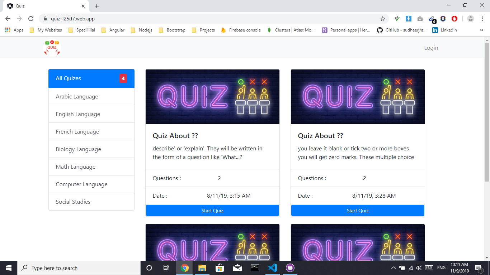
    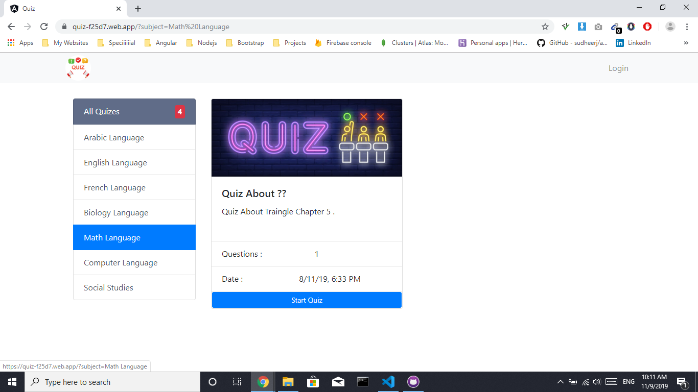
    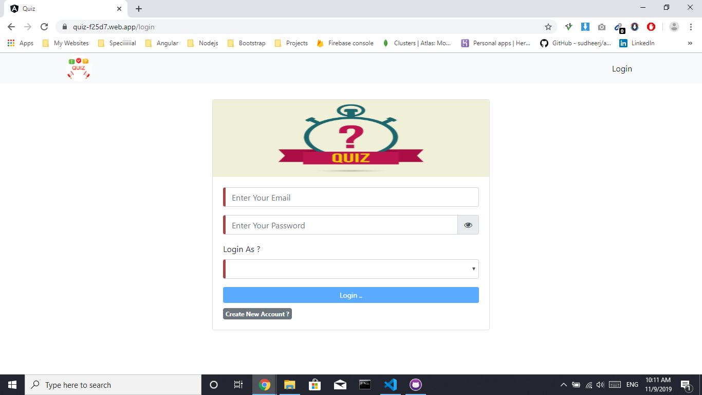
    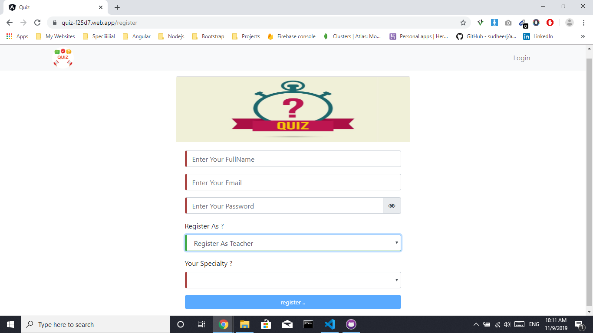
    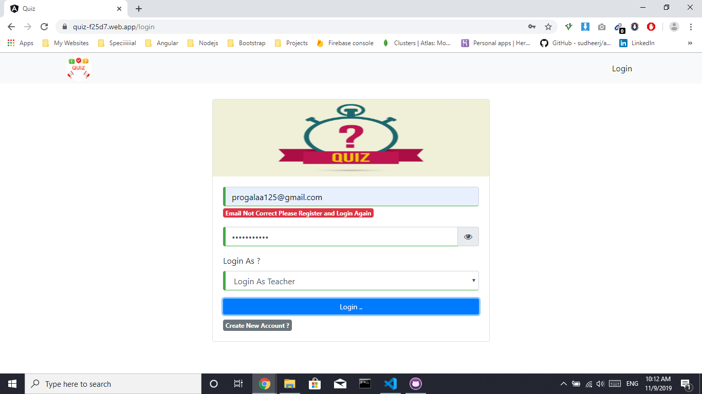
    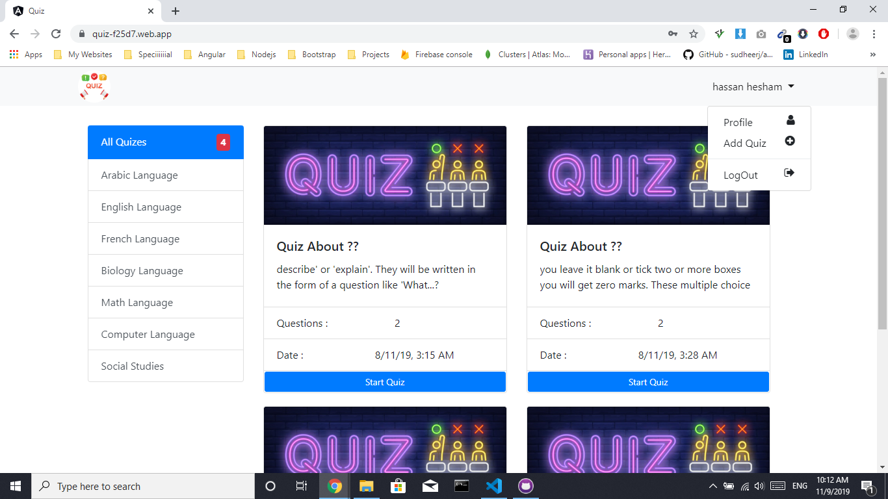
    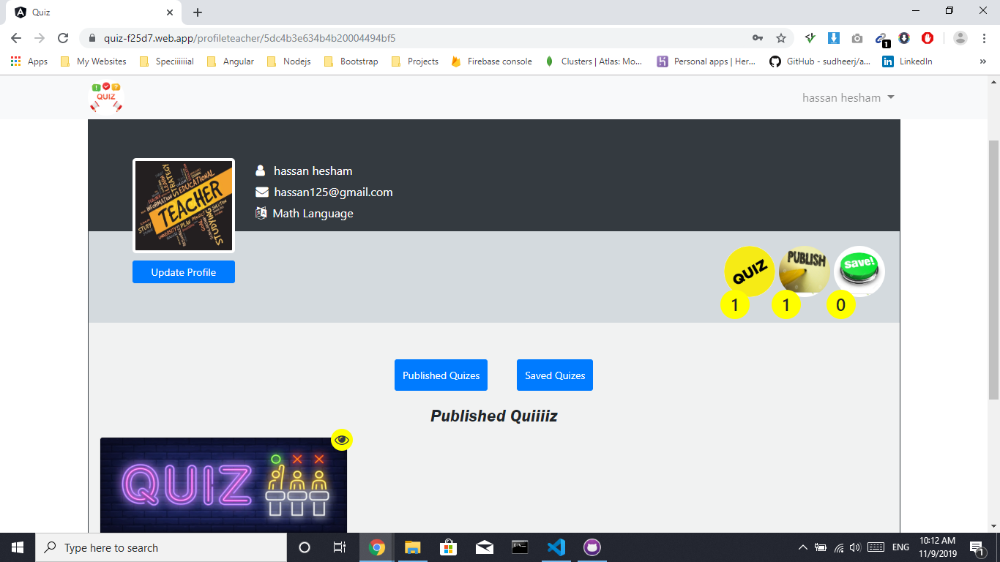
    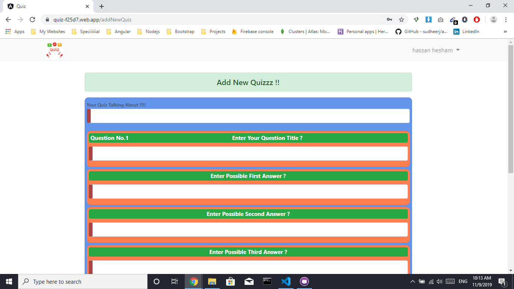
    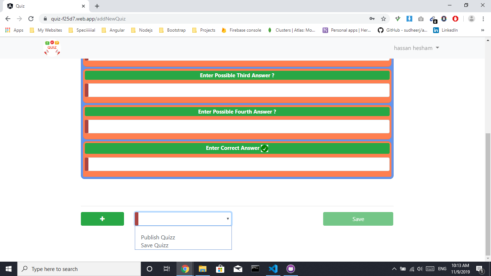
    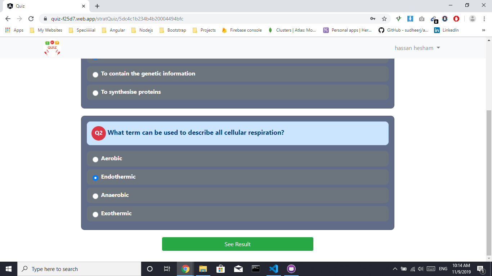
    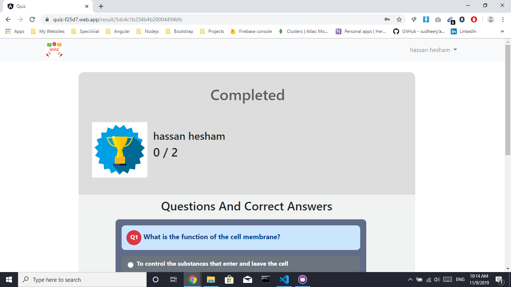
    
  

